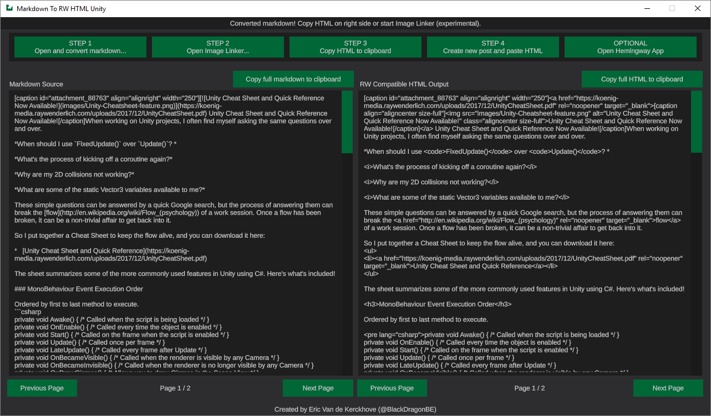

<a href="https://www.paypal.com/paypalme2/blackdragonbe" target="_blank">Click here if you want to donate!</a> Don't feel like like you have to though, I create these tools for fun. :]

# Markdown To RWHTML Unity Version

Useful cross platform + web tool to convert any markdown document to Ray Wenderlich WordPress ready HTML and back!

## Features

- Made in Unity
- Open source
- Convert Markdown to RWHTML
- Quickly replace local image paths with URLS
- Convert RWHTML back to Markdown (BETA)
- Download all images found in RWHTML (Standalone only)

## Flavors

This application comes in two flavors

### Web Version

Link: https://blackdragonbe.github.io/MarkdownToRWHTMLUnity

- Works in any modern desktop browser supporting HTML5 & WebAssembly, no need to install anything!
- Almost 100% functional compared to Standalone version
- Not working in Web Version: RWHTML Image Downloader

### Standalone Version

Link: https://github.com/BlackDragonBE/MarkdownToRWHTMLUnity/releases/latest

- Windows, macOS & linux version available!
- All functionality and highest performance
- No need for an internet connection

## Known Issues

- The RWHTML to Markdown converter can't convert captions
- The Image Downloader doesn't have a similar feature in the WebGL version
- The interface is a bit messy
