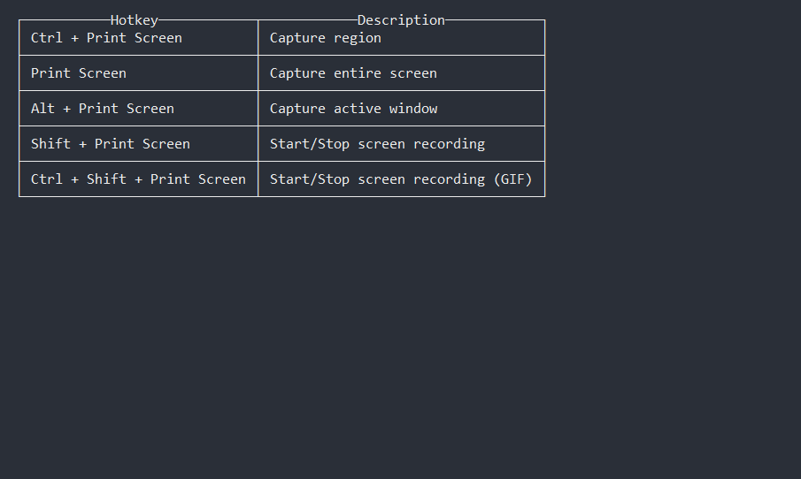

This is a sample markdown file to show how to format an article with markdown. It's used to test the conversion to HTML. 

## Headings

# h1 Heading
## h2 Heading
### h3 Heading
#### h4 Heading
##### h5 Heading
###### h6 Heading

## Basic Formatting

### Line Continuation

By default Markdown **adds paragraphs at double line breaks**. Single line breaks by themselves are simply wrapped together into a single line. If you want to have **soft returns** that break a single line, add **two spaces at the end of the line**.

This line has a paragraph break at the end (empty line after).

Theses two lines should display as a single
line because there's no double space at the end.

The following line has a soft break at the end (two spaces or a `\` at end)  
This line should be following on the very next line.

### Text

**This is bold text**

__This is bold text__

*This is italic text*

_This is italic text_

~~Strikethrough~~

### Bullet lists

* Carrots
* Tomatoes
* Radishes

- Something
- Another thing
- Last item

### Numbered list

1. First
2. Second
3. Third

### Nested list

1. First, get these ingredients:
      * carrots
      * celery
      * lentils
 2. Boil some water.
 3. Dump everything in the pot.

### Hyperlinks

 If you don't have Blender installed on your computer, [download the latest version here](http://www.blender.org/download/get-blender/)

## Images

### Simple Image



### Image with alt text

Simply add text between the square brackets of an image tag to add alt text. This text should shortly explain what's going on in the image. Every image needs alt text before an article is published!


### Image with alt and caption text (RWHTML specific)

You can add a caption to an image by ending the alt text with a pipe '|' and adding the caption text after.


## Notes

### Simple Note

>**Note:** Don't see the elements above? Simply select **File ► New ► General** to generate a default scene.

### Multi line Note

>**Note:** Don't see the elements above? Simply select **File ► New ► General** to generate a default scene.  
>This is another line.  
>Here's another one.

### Note With Image

>**Note:** Remember, you can add images to notes! 
>

### Spoiler (RWHTML specific)

[spoiler title="Solution Inside: Can't remember how to scale?"]
Press the **S** key, move inwards with your cursor and click to confirm.
[/spoiler]

## Code

### Inline Code

Add the `Run()` method below `var Location = "World"`

### Code Block

Add the language right behind the three ticks. This will enable syntax highlighting.

```csharp
// Loop and spit stuff out to the console
for(var i=0; i++; i < 10)
{
    Console.WriteLine(i);
}
```

## Where to Go From Here?

Every article needs to end with an "Where to Go From Here?" section. The converter checks for this and will warn if it's missing.